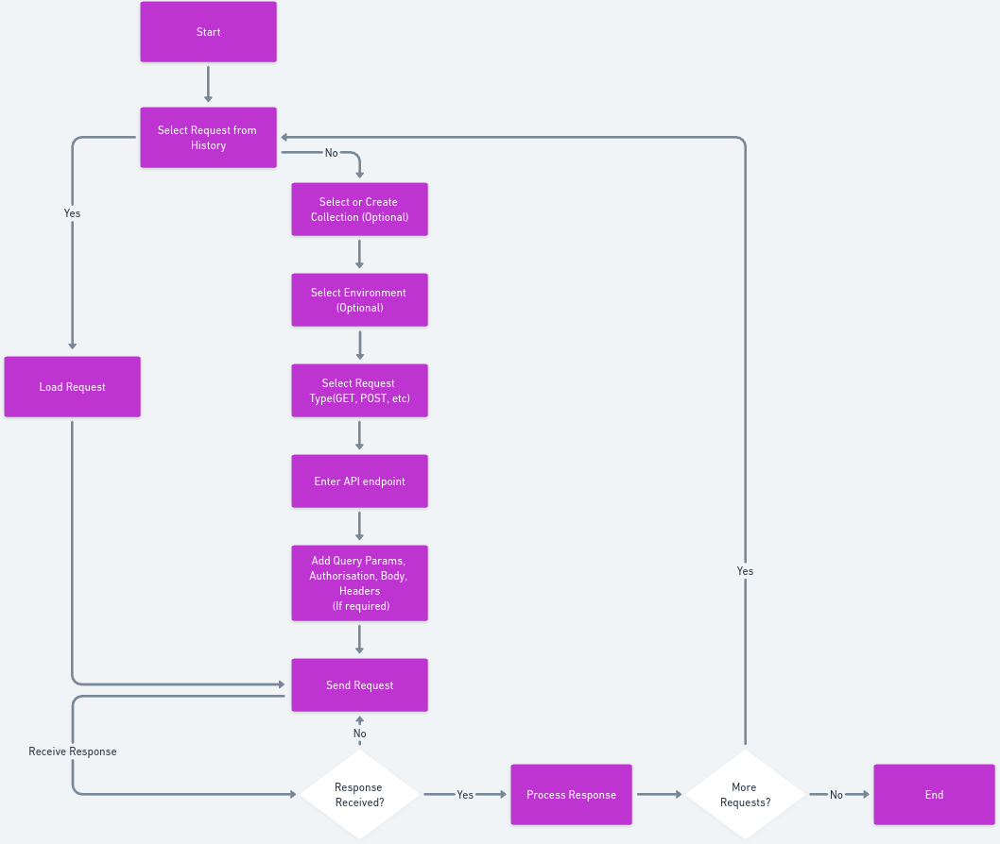

# <p align="center">Postman</p>

<div style="text-align: center;" align="center">
  <figure>
    
    <div>
    <figcaption>UI Flow Chart</figcaption>
    </div>
  </figure>
</div>

----
This project is a clone of Postman, a popular API development and testing tool. The objective is to replicate key functionalities of Postman, including sending API requests, managing environments, and viewing responses, in a web-based interface. 

Features include: 
- API Request Building: Create and send HTTP requests. 
- History Management: View the previous history requests.
- Responsive Design: Responsive components and collapsable sidebar

# File Structure

- [Components](src/components/)
- [Contexts](src/contexts/)
- [Images](src/images/)


## Components
- AuthHeaders.js: Component for handling authentication headers.
- Overview.js: Component providing an overview of the playground.
- PayloadForm.js: Form component for entering payload data.
- Playground.js: Main component for the playground feature.
- QueryParamsTable.js: Component for managing query parameters.
- TabCollections.js: Component for the Collections tab.
- TabEnv.js: Component for the Environment tab.
- TabHistory.js: Component for the History tab.
- Tab.module.css: CSS module for tab-related styles.
## Contexts
- History.js: Context for managing history state.
- HistoryReducer.js: Reducer for history context.
- Store.js: Main context for the application state.
- StoreReducer.js: Reducer for the main application context.
## Images
It consists of various image files used in the application. 

## Setup
To clone and run this application, you'll need Git and Node.js (which comes with npm) installed on your computer. From your command line:

1. Clone this repository
    bash
    $ git clone https://github.com/abhabajpai/Postman_Project.git
    

2. Navigate to Prject Code Directory
    ```bash
    cd Postman_Project
    
3. Install dependencies
    ```bash
    $ npm install
    

4. Run the app
    ```bash
    $ npm start
